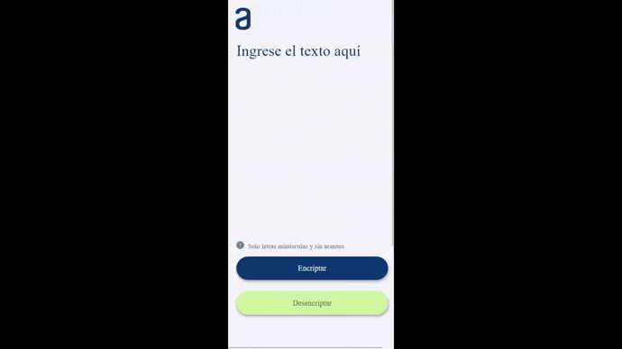

# Encriptador de Texto 💻
**-Este proyecto fue proporcionado por Alura Latam  como un reto a cumplir en el curso  gratuito Oracle Next Education (ONE)**

**-Cual permite encriptar y desencriptar texto utilizando claves predefinidas. A continuación, se presenta una guía sobre las partes más importantes de la estructura del proyecto.**

# Vista Final 👀

# Tecnologías Utilizadas 👾

## Diseño ✍️

## Funcionamiento 🤖

## Planeacion 📑

**Si lo descargas no necesitas intalar nada.**

## Aquí puedes probar la aplicacion web.
**https://roderichlr.github.io/Encriptador/** 

## Indicaciones 💯

 ### Las "llaves" de encriptación que utilizaremos son las siguientes:

- **La letra "e" es convertida para "enter"**
- **La letra "i" es convertida para "imes"**
- **La letra "a" es convertida para "ai"**
- **La letra "o" es convertida para "ober"**
- **La letra "u" es convertida para "ufat"**

##  Requisitos 💪

- **Debe funcionar solo con letras minúsculas.**
- **No deben ser utilizados letras con acentos ni caracteres especiales.**
- **inserción del texto que será encriptado o desencriptado, y el usuario debe poder escoger entre as dos opciones.**
- **El resultado debe ser mostrado en la pantalla.**
- **Debe ser posible convertir una palabra para la versión encriptada también devolver una palabra encriptada para su versión original por ejemplo:**

"gato" => "gaitober"
gaitober" => "gato"

## Funcionalidades🗯️

### Encriptar y Desencriptar Texto 

-El usuario puede ingresar texto en el área de entrada y utilizar los botones "Encriptar" y "Desencriptar" para aplicar las operaciones correspondientes. La encriptación y desencriptación se realizan utilizando claves predefinidas.

### Copiar Texto Encriptado 

Una vez que el texto ha sido encriptado, el usuario puede copiarlo al portapapeles haciendo clic en el botón "Copiar".

### Interfaz Responsiva 

La aplicación está diseñada para ser responsive y adaptarse a diferentes tamaños de pantalla, garantizando una experiencia consistente en dispositivos móviles y de escritorio.

## Consideraciones💥

- La aplicación solo acepta texto en minúsculas, sin acentos ni numeros para su encriptación y desencriptación.

## Contribuciones👌

-Las contribuciones son bienvenidas. Si desea mejorar la aplicación, puede crear una bifurcación del repositorio y enviar solicitudes de extracción con las mejoras propuestas.
